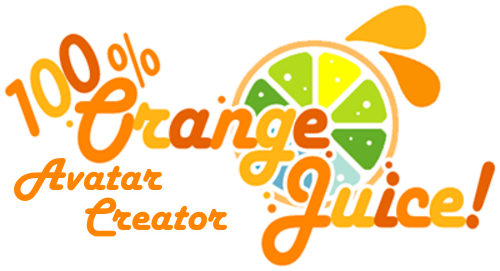

<h1 align="center" id="title">100% Orange Juice Avatar Creator</h1>

<p align="center"></p>

<p align = "center">**Project on hold for a bit**</p>
<p>Due to school and whatnot, the project was paused for months with no updates, but I'll be back after a few weeks and I'll continue work on the project, as it's a personal goal of mine :)</p>
<p id="description">100% Orange Juice Avatar Creator is a fully online avatar creator in your web browser that tries to accurately recreate the same avatar info from the game 100% Orange Juice allowing you to try all single possible outfit combinations for all your favorite characters without needing to spend a single orange or a star!</p>

<h2>🚀 Demo</h2>

[https://pixepchief.github.io/100oj/](https://pixepchief.github.io/100oj/)

<h2>Project Screenshots:</h2>


  
<h2>🧐 Features</h2>

Here're some of the project's best features:

*   All characters from the latest version of the game!
*   Different poses and unit colors combinations!

<h2>🤔 What's next?</h2>

Sadly, the only thing that I couldn't get right for the website is the hair, as they have alpha masks and I have no experience of modding the game to create hair gradients, and as of my current knowledge, there's no possible way to extract all the hair gradient colors from the game. If there's anyone willing to help me with this, feel free to shoot me a message at @pixepchief on Discord.

There are a few things that needs to be fixed, such as:

* ~~A few characters not working due to having different outfits (Hime for example)~~
* Unique characters where there's two characters in one (Chef & Chris, Tomato & Mimyuu, Cuties)

If the major bugs get fixed, then I will get started working on the following with no particular order:
* Adding secondary colors
* Adding hair colors
* Adding accessories
* Adding glasses
* Adding pets
* Adding a view of the cost of your outfit

<h2>🛠️ Installation Steps:</h2>

<p>1. Clone the project</p>

```
git clone https://github.com/pixepchief/100oj
```

<p>2. That's it! The code is entirely in Tailwind CSS and HTML so no need to run anything else.</p>

<h2>🛠 How to use:</h2>

To start the project, simply open the file "index.html".

<p>If you want to edit the project for yourself, and you want to integrate your modded characters into the website or anything of the sort, the entire website depends on a file named "characters.json" which gets generated by the "jsonGen.py" file by taking a look into the characters folder. To my knowledge, there are no depedencies that are required.</p>

To generate  characters.json, use the following command:


```
python ./jsonGen.py
```


  
  
<h2>💻 Built with</h2>

Technologies used in the project:

*   HTML 5
*   Tailwind CSS
*   JavaScript
*   Python
